## Front-End | Programação Orientada a Objetos

  
1. POO

  
  ### O que é POO?
   > O paradigma de programação orientada a objetos [POO](https://pt.wikipedia.org/wiki/Programa%C3%A7%C3%A3o_orientada_a_objetos) é uma abordagem de programação que visa a construção de objetos que se relacionem entre si.

  - O que é uma classe?  
    - Uma classe é um modelo de objeto que contém atributos e métodos.

  - O que é um método?
    - Um método é uma função que pertence a uma classe.

  - O que é um atributo?
    - Um atributo é um valor que pertence a um objeto.

  - O que é um objeto?
    - Um objeto é uma instância de uma classe.

  - O que é uma instância?
    - Uma instância é uma cópia de um objeto.

  - O que é um Construtor?
    - O construtor é um método que é executado quando um objeto é criado.

  ----------------------------------------------------
  ### ECMAScript + JavaScript
  - [ECMAScript](https://www.ecma-international.org) é uma versão da linguagem JavaScript
  - ECMAScript 2021 é a versão mais recente da linguagem
  - Desde 2015, é lançado uma versão todo ano  

----------------------------------------------------

  ### Temos 2 ambientes para executar o JS
  - Console do [Developer Tools](https://developer.mozilla.org/pt-BR/docs/Tools) `Atalho F12`
  > EX: 
  
  ----------------------------------------------------
  - Terminal do Sistema Operacional com [Nodejs](https://nodejs.org/docs/latest-v17.x/api/console.html#console)
  > EX: 
  
  

  
2. Variáveis

  
  ### O que são variáveis?
  > As variáveis armazenam dados que podem ser definidos, atualizados e recuperados. Os valores atribuidos a uma variável têm um tipo. 

  ### Tipos básicos variáveis
  - String: texto
  > EX: 
  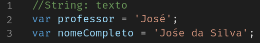
  ----------------------------------------------------
  - Number: números
  > EX: 
  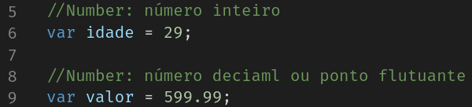
  ----------------------------------------------------
  - Boolean: verdadeiro ou falso
  > EX: 
  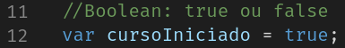
  ----------------------------------------------------
  - Object: objeto
  > EX: 
  
  ----------------------------------------------------
  - Array: lista
  > EX: 
  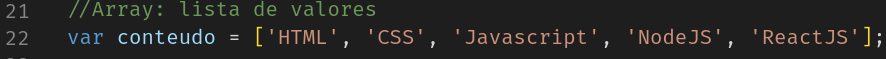
  ----------------------------------------------------
  - Function: função
  > EX: 
  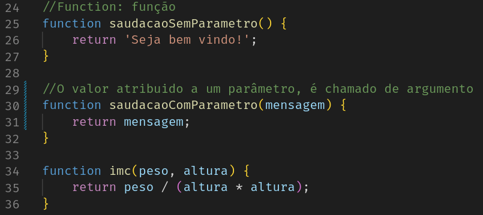
  ----------------------------------------------------
  - Undefined: indefinido
  > EX: 
  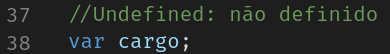
  ----------------------------------------------------
  - Null: nulo
  > EX: 
  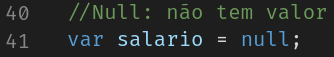
  ----------------------------------------------------

  ### Declaração de variáveis, var, let ou const?
  - var: variável global
  > EX: 
  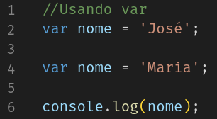
  ----------------------------------------------------
  - const: constante de escopo local
  > EX: 
  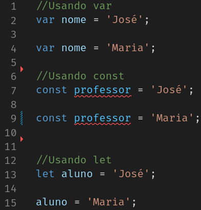
  ----------------------------------------------------
  - let: variável de escopo local
  > EX: 
  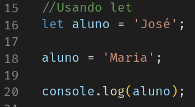
  ----------------------------------------------------

  ### Declaração de arrays?
  - O array é uma estrutura de dados que armazena vários valores em uma única variável.
  > EX: 
  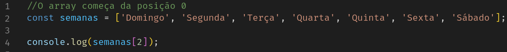
  ----------------------------------------------------

  ### Declaração de funções?
  > EX: 
  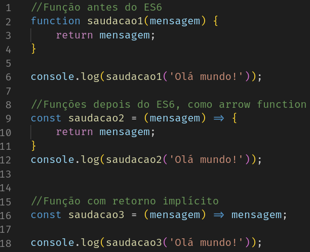

   ----------------------------------------------------

  ### Declaração de objetos?
  > EX: 
  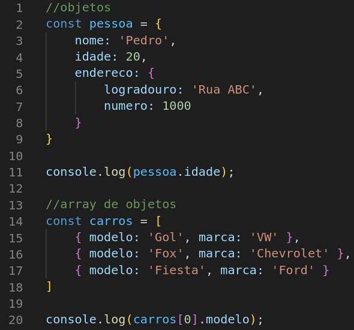

  
3. Operadores 

  
  - O que são operadores?
  > Os operadores são os símbolos que realizam operações matemáticas, lógicas e de comparação.

  - Operadores aritméticos
  > EX:
  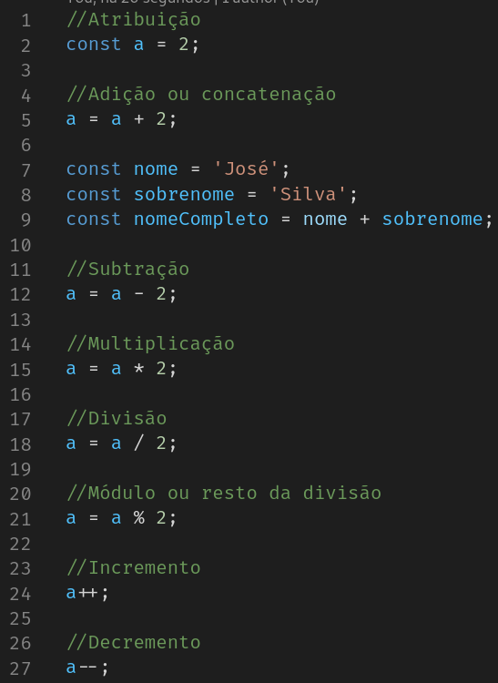
  ----------------------------------------------------
  - Operadores atribuição
  > EX:
  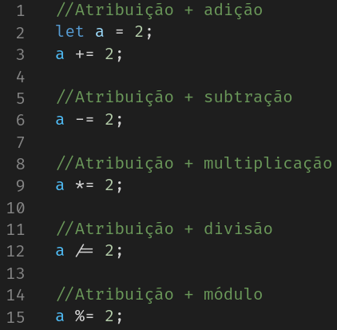
  ----------------------------------------------------
  - Operadores comparação
  > EX:
  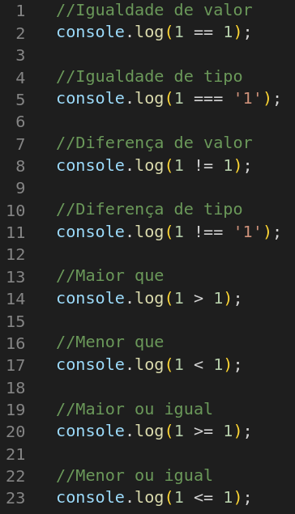
  ----------------------------------------------------
  - Operadores lógicos
  > EX: 
  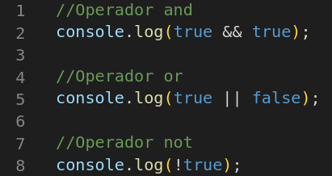  
  ----------------------------------------------------  

  
4. Condicional 

  
  - O que são condicionais?
  > Condicionais são estruturas de decisão que permitem decidir se uma determinada ação deve ser executada ou não.

  - if/else
  > EX:
  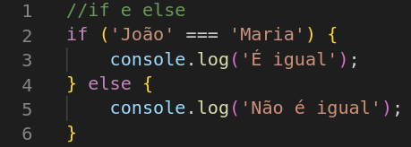
  ----------------------------------------------------
  - if/else com variável
  > EX:
  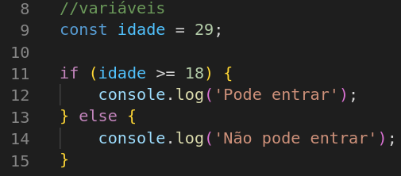
  ----------------------------------------------------
  - if/else com função
  > EX:
  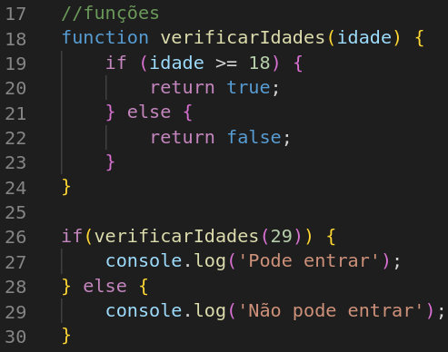
  ----------------------------------------------------
  - if/else if/else
  > EX:
  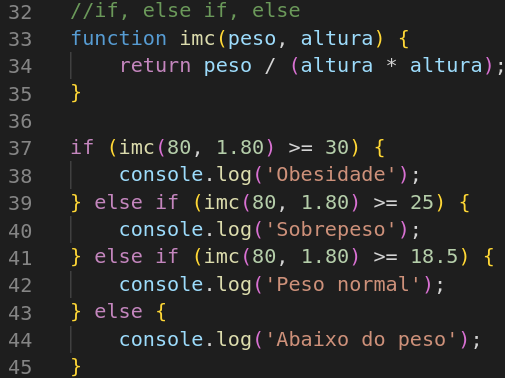
  ----------------------------------------------------
  - ternário
  > EX:
  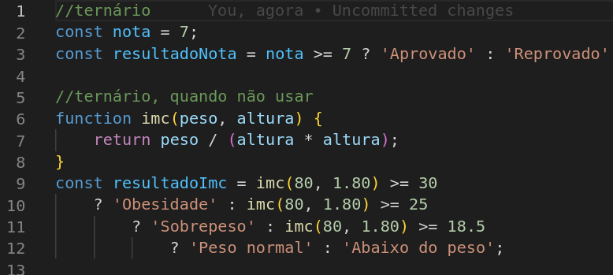
  ----------------------------------------------------
  - switch
  > EX:
  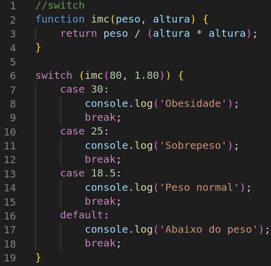
  ----------------------------------------------------
    

  
5. Loop 

  
  - O que são loops?
  > Loops são estruturas de repetição que permitem executar determinada ação várias vezes.

  - for incremento, do 1 até 10
  > EX:
  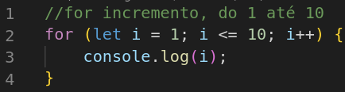
  ----------------------------------------------------
  - for decremento, do 10 até 1
  > EX:
  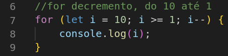
  ----------------------------------------------------
  - for break, vai contar até 4
  > EX:
  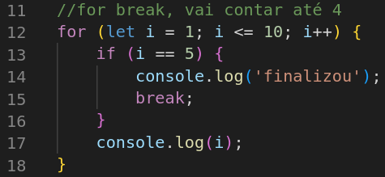
  ----------------------------------------------------
  - for continue, vai contar até 4
  > EX:
  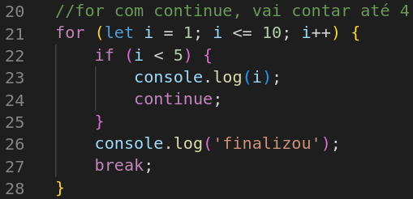
  ----------------------------------------------------
  - for com array 
  > EX:
  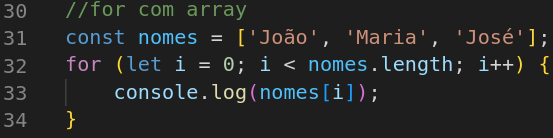
  ----------------------------------------------------
  - while incremento, do 1 até 10 
  > EX:
  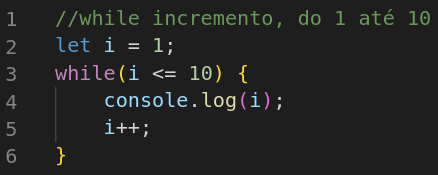
  ----------------------------------------------------
  - while decremento, do 10 até 1
  > EX:
  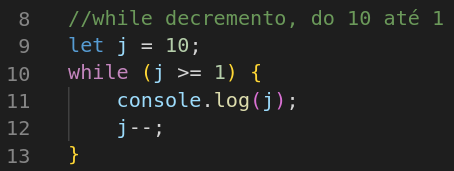
  ----------------------------------------------------
  - do while incremento, do 1 até 10
  > EX:
  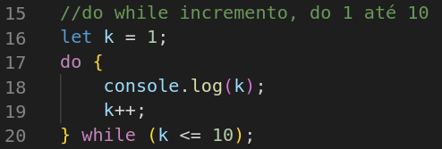
  ----------------------------------------------------
  - do while decremento, do 10 até 1
  > EX:
  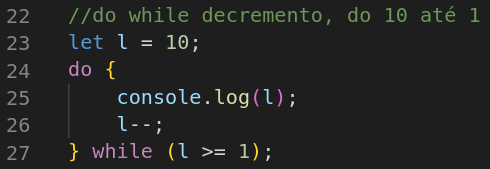
  ----------------------------------------------------
  - array com while
  > EX:
  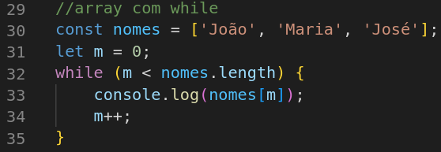    

###### tags: `Frontend` `nodeJS` `JavaScript` `variaveis` `condicional` `operadores` `loop`